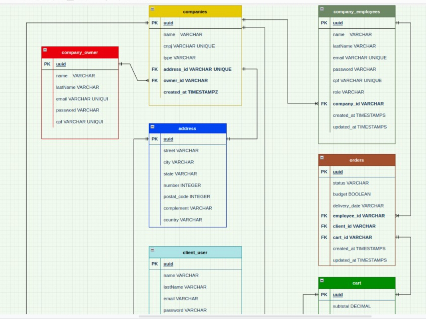
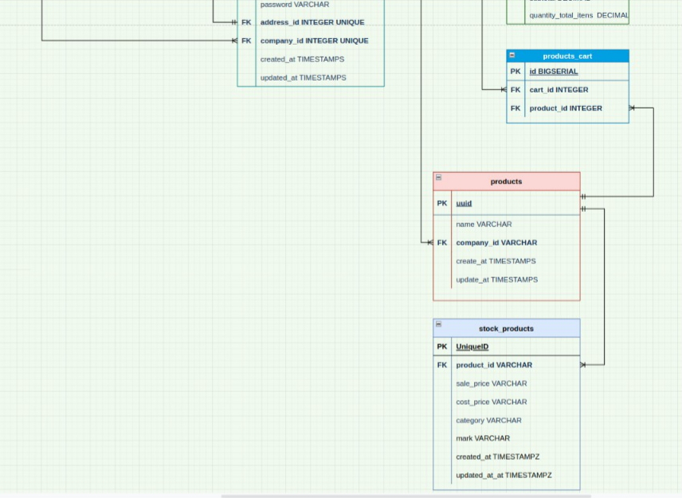

# Documentação da API

## Tabela de Conteúdos

[Visão Geral](#1-visão-geral)

---

## 1. Visão Geral

Visão geral do projeto, um pouco das tecnologias usadas.

- [NodeJS](https://nodejs.org/en/)
- [Express](https://expressjs.com/pt-br/)
- [TypeScript](https://www.typescriptlang.org/)
- [PostgreSQL](https://www.postgresql.org/)
- [TypeORM](https://typeorm.io/)
- [Yup](https://www.npmjs.com/package/yup)

A URL base da aplicação:
http://localhost:3000

---

## 2. Diagrama ER

[ Voltar para o topo ](#tabela-de-conteúdos)

Diagrama ER da API definindo bem as relações entre as tabelas do banco de dados.




---

## 3. Início Rápido

[ Voltar para o topo ](#tabela-de-conteúdos)

### 3.1. Instalando Dependências

Clone o projeto em sua máquina e instale as dependências com o comando:

```shell
yarn
```

### 3.2. Variáveis de Ambiente

Em seguida, crie um arquivo **.env**, copiando o formato do arquivo **.env.example**:

```
cp .env.example .env
```

Configure suas variáveis de ambiente com suas credenciais do Postgres e uma nova database da sua escolha.

### 3.3. Migrations

Execute as migrations com o comando:

```
yarn typeorm migration:run -d src/data-source.ts
```

---

## 4. Autenticação

[ Voltar para o topo ](#tabela-de-conteúdos)

Por enquanto, não foi implementada autenticação.

---

## 5. Endpoints

[ Voltar para o topo ](#tabela-de-conteúdos)

- [Owners](#1-Owners)
  - [POST - /owners](#11-Criação-de-Owner)
  - [GET - /owners](#12-Listando-Owners)
  - [GET - /owners/:id](#13-Listando-um-Owner)
  - [PATCH - /owners/:id](#14-Atualizando-Owners)
  - [DELETE - /owners/:id](#15-Deletando-Owners)
- [Clients](#2-Clients)
  - [POST - /clients](#21-Criação-de-Client)
  - [GET - /clients](#22-Listando-Clients)
  - [GET - /clients/:id](#23-Listando-um-Client)
  - [PATCH - /clients/:id](#24-Atualizando-Clients)
  - [DELETE - /clients/:id](#25-Deletando-Clients)
- [Sessions](#3-Sessions)
  - [POST - /sessions](#31-Login-de-Usuario)
- [Addresses](#4-Addresses)
  - [POST - /Addresses](#41-Criação-de-Address)
  - [GET - /Addresses](#42-Listando-Addresses)
  - [GET - /Addresses/:id](#43-Listando-um-Address)
  - [PATCH - /Addresses/:id](#44-Atualizando-Addresses)
  - [DELETE - /Addresses/:id](#45-Deletando-Addresses)

---

## 1. **Owners**

[ Voltar para os Endpoints ](#5-endpoints)

O objeto owner é definido como:

| Campo     | Tipo   | Descrição                     |
| --------- | ------ | ----------------------------- |
| id        | string | Identificador único do owner  |
| name      | string | O primeiro nome do owner.     |
| lastName  | string | O sobrenome do owner.         |
| email     | string | O e-mail do owner.            |
| password  | string | A senha de acesso do owner.   |
| cpf       | string | O CPF do owner.               |
| role      | string | A função do owner.            |
| company   | string | A empresa do owner.           |
| create_at | string | Data da criação do owner.     |
| update_at | string | Data da atualização do owner. |

### Endpoints

| Método | Rota        | Descrição                  |
| ------ | ----------- | -------------------------- |
| POST   | /owners     | Criação de um Owner.       |
| GET    | /owners     | Lista todos os Owners.     |
| GET    | /owners/:id | Lista todos um dos Owners. |
| PATCH  | /owners/:id | Atualiza um dos Owners.    |
| DELETE | /owners/:id | Deleta um dos Owners.      |

---

### 1.1. **Criação de owner**

[ Voltar para os Endpoints ](#5-endpoints)

### `/owners`

### Exemplo de Request:

```
POST /owners
Host: http://localhost:3000
Authorization: None
Content-type: application/json
```

### Corpo da Requisição:

```json
{
  "name": "Yorran",
  "lastName": "Rodrigues",
  "email": "yorran@email.com",
  "password": "senhaForte",
  "cpf": "12312312312",
  "cellphone": "+55(31)9 9876-5432"
}
```

### Schema de Validação com Yup:

```javascript
    name: yup.string().required("name is required"),
	lastName: yup.string().required("lastName is required"),
	email: yup.string().required("email is required"),
	password: yup.string().required("password is required"),
	cpf: yup.number().required("cpf is required"),
	cellphone: yup.number().required("cellphone is required"),
```

OBS.: Chaves não presentes no schema serão removidas.

### Exemplo de Response:

```
201 Created
```

```json
Colocar response do insomnia¨¨¨¨¨¨¨¨¨¨________________
```

### Possíveis Erros:

| Código do Erro | Descrição                     |
| -------------- | ----------------------------- |
| 409 Conflict   | Email already registered.     |
| 409 Conflict   | CPF already registered.       |
| 409 Conflict   | Cellphone already registered. |

---

### 1.2. **Listando owners**

[ Voltar aos Endpoints ](#5-endpoints)

### `/owners`

### Exemplo de Request:

```
GET /owners
Host: http://localhost:3000
Authorization: JWS Token
Content-type: application/json
```

### Corpo da Requisição:

```json
Vazio
```

### Exemplo de Response:

```
200 OK
```

```json
Colocar response do insomnia¨¨¨¨¨¨¨¨¨¨________________
```

### Possíveis Erros:

Nenhum, o máximo que pode acontecer é retornar uma lista vazia.

---

### 1.3. **Listando um owner**

[ Voltar aos Endpoints ](#5-endpoints)

### `/owners/:id`

### Exemplo de Request:

```
GET /owners/:id
Host: http://localhost:3000
Authorization: JWS Token
Content-type: application/json
```

### Corpo da Requisição:

```json
Vazio
```

### Exemplo de Response:

```
200 OK
```

```json
Colocar response do insomnia¨¨¨¨¨¨¨¨¨¨________________
```

### Possíveis Erros:

Nenhum, o máximo que pode acontecer é retornar uma lista vazia.

---

### 1.4. **Atualizando owners**

[ Voltar aos Endpoints ](#5-endpoints)

### `/owners/:id`

### Exemplo de Request:

```
PATCH /owners/:id
Host: http://localhost:3000
Authorization: None
Content-type: application/json
```

### Corpo da Requisição:

```json
{
  "password": "senhaForte123"
}
```

```json
{
  "email": "outro@email.com"
}
```

### Exemplo de Response:

```
200 OK
```

```json
Colocar response do insomnia¨¨¨¨¨¨¨¨¨¨________________
```

### Possíveis Erros:

Nenhum, o máximo que pode acontecer é retornar uma lista vazia.

---

### 1.5. **Deletando owners**

[ Voltar aos Endpoints ](#5-endpoints)

### `/owners/:id`

### Exemplo de Request:

```
DELETE /owners/:id
Host: http://localhost:3000
Authorization: None
Content-type: application/json
```

### Corpo da Requisição:

```json
Vazio
```

### Exemplo de Response:

```
200 OK
```

```json
Colocar response do insomnia¨¨¨¨¨¨¨¨¨¨________________
```

### Possíveis Erros:

Nenhum, o máximo que pode acontecer é retornar uma lista vazia.

---

---

## 2. **Clients**

[ Voltar para os Endpoints ](#5-endpoints)

O objeto Client é definido como:

| Campo    | Tipo   | Descrição                     |
| -------- | ------ | ----------------------------- |
| id       | string | Identificador único do Client |
| name     | string | O primeiro nome do Client.    |
| lastName | string | O sobrenome do Client.        |
| email    | string | O e-mail do Client.           |
| password | string | A senha de acesso do Client   |

### Endpoints

| Método | Rota         | Descrição                   |
| ------ | ------------ | --------------------------- |
| POST   | /clients     | Criação de um Client.       |
| GET    | /clients     | Lista todos os Clients.     |
| GET    | /clients/:id | Lista todos um dos Clients. |
| PATCH  | /clients/:id | Atualiza um dos Clients.    |
| DELETE | /clients/:id | Deleta um dos Clients.      |

---

### 2.1. **Criação de Client**

[ Voltar para os Endpoints ](#5-endpoints)

### `/clients`

### Exemplo de Request:

```
POST /clients
Host: http://localhost:3000
Authorization: None
Content-type: application/json
```

### Corpo da Requisição:

```json
{
  "name": "Yorran",
  "lastName": "Rodrigues",
  "email": "yorran@email.com",
  "password": "senhaForte"
}
```

### Schema de Validação com Yup:

```javascript
    name: yup.string().required("name is required"),
    lastName: yup.string().required("name is required"),
    email: yup.string().required("email is required"),
    password: yup.string().required("password is required"),
```

OBS.: Chaves não presentes no schema serão removidas.

### Exemplo de Response:

```
201 Created
```

```json
{
  "id": "0d841ce1-3d8f-4aa1-ad34-24528c8c8a91",
  "name": "Yorran",
  "lastName": "Rodrigues",
  "email": "yorran@email.com",
  "password": "$2a$08$xStHwkfZi2UzOW797eFJvudNmx7O2eTWq8ncwhBoKdwNhuZo0HOHS",
  "created_at": "2022-05-19T17:02:46.995Z",
  "updated_at": "2022-05-19T17:02:46.995Z"
}
```

### Possíveis Erros:

| Código do Erro | Descrição                 |
| -------------- | ------------------------- |
| 409 Conflict   | Email already registered. |

---

### 2.2. **Listando Clients**

[ Voltar aos Endpoints ](#5-endpoints)

### `/clients`

### Exemplo de Request:

```
GET /clients
Host: http://localhost:3000
Authorization: JWS Token
Content-type: application/json
```

### Corpo da Requisição:

```json
Vazio
```

### Exemplo de Response:

```
200 OK
```

```json
[
  {
    "id": "0d841ce1-3d8f-4aa1-ad34-24528c8c8a91",
    "name": "Yorran",
    "lastName": "Rodrigues",
    "email": "yorran@email.com",
    "password": "$2a$08$xStHwkfZi2UzOW797eFJvudNmx7O2eTWq8ncwhBoKdwNhuZo0HOHS",
    "created_at": "2022-05-19T17:02:46.995Z",
    "updated_at": "2022-05-19T17:02:46.995Z"
  },
  {
    "id": "0d82421-4d2f-4bb1-ad42-24428c4c8a42",
    "name": "Casotenha",
    "lastName": "Outroclient",
    "email": "ale@torio.com",
    "password": "$2a$08$xStHwkfZi2UzOW797eFJvudNmx7O2eTWq8ncwhBoKdwNhuZo0HOHS",
    "created_at": "2022-05-19T17:02:42.995Z",
    "updated_at": "2022-05-19T17:02:42.995Z"
  }
]
```

### Possíveis Erros:

Nenhum, o máximo que pode acontecer é retornar uma lista vazia.

---

### 2.3. **Listando um Client**

[ Voltar aos Endpoints ](#5-endpoints)

### `/clients/:id`

### Exemplo de Request:

```
GET /clients/:id
Host: http://localhost:3000
Authorization: JWS Token
Content-type: application/json
```

### Corpo da Requisição:

```json
Vazio
```

### Exemplo de Response:

```
200 OK
```

```json
[
  {
    "id": "0d841ce1-3d8f-4aa1-ad34-24528c8c8a91",
    "name": "Yorran",
    "lastName": "Rodrigues",
    "email": "yorran@email.com",
    "password": "$2a$08$xStHwkfZi2UzOW797eFJvudNmx7O2eTWq8ncwhBoKdwNhuZo0HOHS",
    "created_at": "2022-05-19T17:02:46.995Z",
    "updated_at": "2022-05-19T17:02:46.995Z"
  }
]
```

### Possíveis Erros:

Nenhum, o máximo que pode acontecer é retornar uma lista vazia.

---

### 2.4. **Atualizando Clients**

[ Voltar aos Endpoints ](#5-endpoints)

### `/clients/:id`

### Exemplo de Request:

```
PATCH /clients/:id
Host: http://localhost:3000
Authorization: None
Content-type: application/json
```

### Corpo da Requisição:

```json
{
  "name": "Bernardo",
  "lastName": "Enock",
  "email": "enock@email.com",
  "password": "senhaForte123"
}
```

```json
{
  "email": "bernardo@email.com"
}
```

### Exemplo de Response:

```
200 OK
```

```json
Colocar response do insomnia¨¨¨¨¨¨¨¨¨¨________________
```

### Possíveis Erros:

Nenhum, o máximo que pode acontecer é retornar uma lista vazia.

---

### 2.5. **Deletando Clients**

[ Voltar aos Endpoints ](#5-endpoints)

### `/clients/:id`

### Exemplo de Request:

```
DELETE /clients/:id
Host: http://localhost:3000
Authorization: None
Content-type: application/json
```

### Corpo da Requisição:

```json
Vazio
```

### Exemplo de Response:

```
200 OK
```

```json
Colocar response do insomnia¨¨¨¨¨¨¨¨¨¨________________
```

### Possíveis Erros:

Nenhum, o máximo que pode acontecer é retornar uma lista vazia.

---

## 3. **Sessions**

[ Voltar aos Endpoints ](#5-endpoints)

O objeto login é definido como:

| Campo    | Tipo   | Descrição                     |
| -------- | ------ | ----------------------------- |
| email    | string | O e-mail do Usuario.          |
| password | string | A senha de acesso do Usuario. |

### Endpoints

| Método | Rota      | Descrição |
| ------ | --------- | --------- |
| POST   | /sessions | Logar.    |

### 3.1. **Login de Usuario**

[ Voltar para os Endpoints ](#5-endpoints)

### `/sessions`

### Exemplo de Request:

```
POST /sessions
Host: http://localhost:3000
Authorization: None
Content-type: application/json
```

### Corpo da Requisição:

```json
{
  "email": "yorran@email.com",
  "password": "senhaForte"
}
```

## 4. **Addresses**

[ Voltar para os Endpoints ](#5-endpoints)

O objeto Client é definido como:

| Campo       | Tipo   | Descrição                      |
| ----------- | ------ | ------------------------------ |
| id          | string | Identificador único do Address |
| street      | string | A rua do Address.              |
| city        | string | A cidade do Address.           |
| state       | string | O estado do Address.           |
| number      | string | O numero do Address.           |
| postal_code | string | CEP do Address.                |
| complement  | string | O complemento do Address.      |
| country     | string | O numero do Address.           |

### Endpoints

| Método | Rota           | Descrição                    |
| ------ | -------------- | ---------------------------- |
| POST   | /addresses     | Criação de um Address.       |
| GET    | /addresses     | Lista todos os Addresss.     |
| GET    | /addresses/:id | Lista todos um dos Addresss. |
| PATCH  | /addresses/:id | Atualiza um dos Addresss.    |
| DELETE | /addresses/:id | Deleta um dos Addresss.      |

---

### 4.1. **Criação de Address**

[ Voltar para os Endpoints ](#5-endpoints)

### `/addresss`

### Exemplo de Request:

```
POST /addresses
Host: http://localhost:3000
Authorization: None
Content-type: application/json
```

### Corpo da Requisição:

```json
pegar do insomnia¨¨¨¨¨¨¨¨¨¨________________
```

### Schema de Validação com Yup:

```javascript
    country: yup.string().required("country is required"),
    state: yup.string().required("state is required"),
    city: yup.string().required("city is required"),
    street: yup.string().required("street is required"),
    number: yup.number().required("number is required"),
    complement: yup.string(),
    postalcode: yup.number().required("postalcode is required"),
```

OBS.: Chaves não presentes no schema serão removidas.

### Exemplo de Response:

```
201 Created
```

```json
pegar do insomnia¨¨¨¨¨¨¨¨¨¨________________
```

### Possíveis Erros:

| Código do Erro | Descrição                   |
| -------------- | --------------------------- |
| 409 Conflict   | Address already registered. |

---

### 4.2. **Listando Addresss**

[ Voltar aos Endpoints ](#5-endpoints)

### `/addresses`

### Exemplo de Request:

```
GET /addresses
Host: http://localhost:3000
Authorization: JWS Token
Content-type: application/json
```

### Corpo da Requisição:

```json
Vazio
```

### Exemplo de Response:

```
200 OK
```

```json
pegar do insomnia¨¨¨¨¨¨¨¨¨¨________________
```

### Possíveis Erros:

Nenhum, o máximo que pode acontecer é retornar uma lista vazia.

---

### 4.3. **Listando um Address**

[ Voltar aos Endpoints ](#5-endpoints)

### `/addresses/:id`

### Exemplo de Request:

```
GET /addresses/:id
Host: http://localhost:3000
Authorization: JWS Token
Content-type: application/json
```

### Corpo da Requisição:

```json
Vazio
```

### Exemplo de Response:

```
200 OK
```

```json
pegar do insomnia¨¨¨¨¨¨¨¨¨¨________________
```

### Possíveis Erros:

Nenhum, o máximo que pode acontecer é retornar uma lista vazia.

---

### 4.4. **Atualizando Addresses**

[ Voltar aos Endpoints ](#5-endpoints)

### `/addresses/:id`

### Exemplo de Request:

```
PATCH /addresses/:id
Host: http://localhost:3000
Authorization: None
Content-type: application/json
```

### Corpo da Requisição:

```json
pegar do insomnia¨¨¨¨¨¨¨¨¨¨________________
```

### Exemplo de Response:

```
200 OK
```

```json
Colocar response do insomnia¨¨¨¨¨¨¨¨¨¨________________
```

### Possíveis Erros:

Nenhum, o máximo que pode acontecer é retornar uma lista vazia.

---

### 4.5. **Deletando Addresses**

[ Voltar aos Endpoints ](#5-endpoints)

### `/addresses/:id`

### Exemplo de Request:

```
DELETE /addresses/:id
Host: http://localhost:3000
Authorization: None
Content-type: application/json
```

### Corpo da Requisição:

```json
Vazio
```

### Exemplo de Response:

```
200 OK
```

```json
Colocar response do insomnia¨¨¨¨¨¨¨¨¨¨________________
```

### Possíveis Erros:

Nenhum, o máximo que pode acontecer é retornar uma lista vazia.

---
